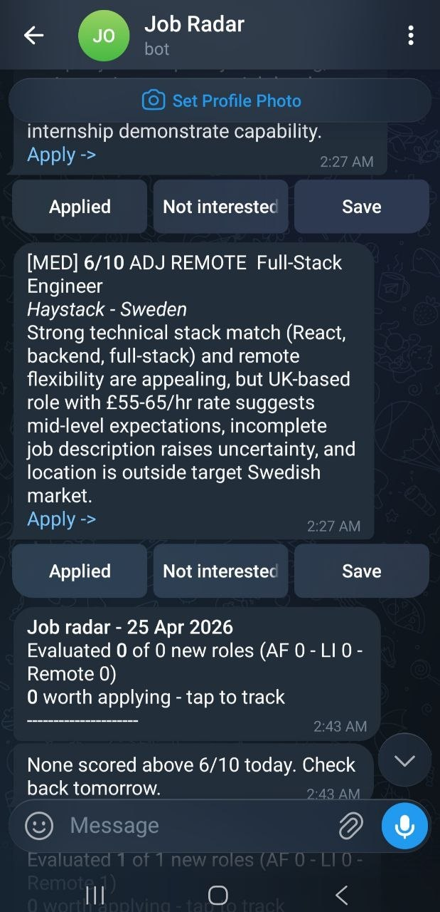
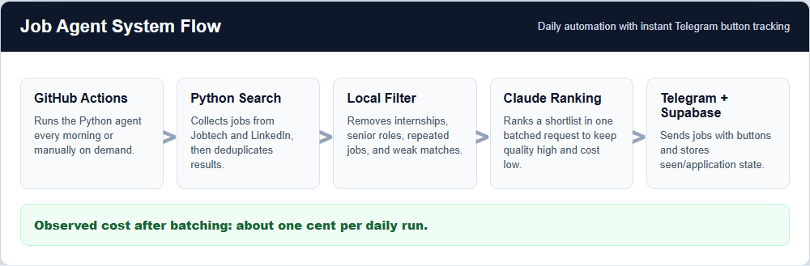

# Job Agent

Daily AI-assisted job search agent for Sweden. It collects roles from
Arbetsformedlingen (Jobtech API), Remotive, and RemoteOK, filters out poor fits
and spammy sources, asks Claude Haiku to batch-rank a shortlist against a
candidate profile, and sends a ranked Telegram digest every morning.

The runtime is intentionally small: one scheduled Python workflow, public job
APIs, a private profile prompt, local JSON/Supabase state, and Telegram
delivery. The code is split by responsibility so source collection, filtering,
scoring, state, and Telegram delivery can evolve independently.

## Features

- Fetches Swedish roles from the Arbetsformedlingen Jobtech API across multiple targeted queries
- Fetches remote roles from Remotive (software-dev, devops, QA categories) and RemoteOK
- Deduplicates roles across all three sources
- Pre-filters by title/description keywords and location eligibility before spending any LLM tokens
- Filters out stale postings older than `MAX_JOB_AGE_DAYS` days, default `45`
- On-site/hybrid roles must be in a commutable area (Stockholm, Uppsala, Gavle, Dalarna)
- Remote roles must be EU/Sweden/EMEA/time-zone compatible or from a reputable company
- Blocks low-quality job boards, task-work listings, talent pools, AI-training
  spam, and freelance marketplaces before LLM scoring
- Targets junior development, QA automation, test automation,
  application/technical/cloud support, integration, system developer, junior
  DevOps, technical consultant, implementation consultant, and SQL/API
  application specialist roles
- Locally ranks and diversifies the shortlist (max 2 roles per company) before scoring
- Scores jobs with a single batched Claude Haiku call for consistent quality at low cost
- Uses prompt caching so the candidate profile is never re-tokenized mid-run
- Sends a ranked Telegram digest with Apply / Save / Not Interested inline buttons
- Processes Telegram button callbacks via long-polling or an instant Vercel webhook
- Persists seen jobs, tracker state, and update offsets between GitHub Actions runs
- Supports Supabase for shared hosted state and a Vercel webhook for instant button tracking
- Runs manually or on a GitHub Actions schedule

## Code Layout

`job_agent.py` is a compatibility entrypoint used by GitHub Actions and local
runs. The application code lives in `job_agent_app/`:

- `config.py` - environment variables, paths, limits, and candidate profile loading
- `filters.py` - relevance filters, spam/source quality checks, role boosts,
  location rules, and candidate diversification
- `sources.py` - Jobtech, Remotive, and RemoteOK fetch/parse logic
- `scoring.py` - Claude prompts, request payloads, and JSON response parsing
- `telegram.py` - digest messages, inline buttons, callback polling, and pipeline summary
- `state.py` - seen jobs, tracker state, and Telegram update offset persistence
- `pipeline.py` - top-level workflow orchestration
- `utils.py` - shared helpers

## Screenshots

Portfolio-safe demo screenshots generated from the current workflow:





## Public Repo Safety

Do not commit personal profile data, Telegram chat IDs, API keys, or generated tracker files.

This repo keeps those out of source control:

- `ANTHROPIC_API_KEY`, `TELEGRAM_TOKEN`, and `TELEGRAM_CHAT_ID` are read from GitHub Actions secrets.
- `CANDIDATE_PROFILE` can be stored as a GitHub Actions secret.
- `SUPABASE_URL` and `SUPABASE_SERVICE_ROLE_KEY` can be stored as GitHub/Vercel secrets for shared hosted state.
- `TELEGRAM_WEBHOOK_SECRET` can be stored as a Vercel secret to validate Telegram webhook requests.
- For local runs, `candidate_profile.txt` can be placed beside `job_agent.py`; it is ignored by Git.
- `seen_jobs.json` and `tracker.json` are generated runtime state and ignored by Git.
- On GitHub Actions, runtime state is stored in an Actions cache, not committed to the repository.

## Supabase + Vercel

The project works without hosted state, but Supabase and Vercel make Telegram
buttons update immediately rather than on the next scheduled run.

1. Create a Supabase project.
2. Run `supabase_schema.sql` in the Supabase SQL editor.
3. Add these GitHub Actions secrets:
   - `SUPABASE_URL`
   - `SUPABASE_SERVICE_ROLE_KEY`
4. Deploy this repo to Vercel.
5. Add these Vercel environment variables:
   - `TELEGRAM_TOKEN`
   - `TELEGRAM_CHAT_ID`
   - `TELEGRAM_WEBHOOK_SECRET`
   - `SUPABASE_URL`
   - `SUPABASE_SERVICE_ROLE_KEY`
6. Register the Telegram webhook:

```bash
curl "https://api.telegram.org/bot$TELEGRAM_TOKEN/setWebhook" \
  -d "url=https://YOUR_VERCEL_DOMAIN/api" \
  -d "secret_token=$TELEGRAM_WEBHOOK_SECRET" \
  -d 'allowed_updates=["callback_query"]'
```

## Setup

1. Fork or clone this repo.
2. Add these secrets in GitHub: Settings > Secrets and variables > Actions.
   - `TELEGRAM_TOKEN`
   - `TELEGRAM_CHAT_ID`
   - `ANTHROPIC_API_KEY`
   - `CANDIDATE_PROFILE`
   - `MAX_JOB_AGE_DAYS` optional, defaults to `45`
3. Enable Actions in the Actions tab.
4. Trigger the workflow manually first to test it.

## Local Run

```bash
pip install -r requirements.txt
```

Create `candidate_profile.txt` locally, then set the required environment variables and run:

```bash
python job_agent.py
```
